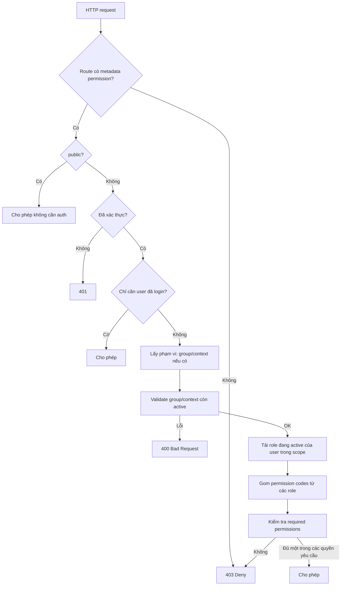

# Luồng phân quyền & kiểm tra quyền (RBAC nâng cao)

## Nguồn tham khảo

- Link tham khảo: [ChatGPT — Phân quyền RBAC nâng cao](https://chatgpt.com/s/t_69db6af8b7fc8191b9e6da8af3bd779b)

**Lưu ý:** Trang chia sẻ ChatGPT thường **không công khai toàn bộ nội dung hội thoại** (yêu cầu đăng nhập / chỉ hiển thị khung UI). Tài liệu dưới đây là **khung luồng & logic** phù hợp chủ đề “RBAC nâng cao” (phạm vi theo ngữ cảnh, cache, kế thừa quyền) và được **đối chiếu với cách triển khai trong repo `comic`**, không phải bản sao nguyên văn từ cuộc chat.

---

## 1. Khái niệm cốt lõi

| Thành phần | Vai trò |
|------------|---------|
| **Permission (quyền)** | Chuỗi định danh tác vụ (ví dụ `comic.update`). Có thể có **cây cha–con** (quyền con kế thừa kiểm tra từ quyền cha). |
| **Role (vai trò)** | Nhóm quyền; gán cho user để không gán từng permission thủ công. |
| **Assignment (gán)** | Liên kết user ↔ role, thường **theo phạm vi** (global / theo group / theo tenant). |
| **Context** | “Không gian” áp dụng role (ví dụ loại ngữ cảnh `system` vs `group`): role chỉ hợp lệ trong context đã cấu hình. |
| **Policy mặc định** | **Deny by default**: không khai báo rõ thì từ chối. |

---

## 2. Luồng tổng quát (thiết kế)

**Logic kiểm tra quyền thường gồm:**

1. **Chuẩn bị chỉ mục permission** (danh sách permission active, map code → chỉ số / cây parent).
2. **Xác định scope**: user + `groupId` (hoặc `null` = system/global tùy thiết kế).
3. **Lấy role IDs** đang gán và active cho user trong scope.
4. **Suy ra tập permission** (union các permission của các role).
5. **So khớp** với danh sách permission route yêu cầu: thường **OR** (chỉ cần một), có thể mở rộng AND nếu policy khác.
6. **Kế thừa / siêu quyền**: ví dụ có `system.manage` thì coi như pass mọi kiểm tra; hoặc đi lên cây `parentCode` cho đến khi gặp permission đã gán.

---

## 3. Tối ưu & vận hành (RBAC “nâng cao”)

- **Cache theo (user, group)**: bitmap hoặc set permission để tránh query lặp mỗi request.
- **Cache theo request**: cùng một request gọi nhiều lần thì dùng chung kết quả.
- **Invalidate / version**: khi đổi role–permission hoặc gán role, bump version hoặc refresh bitmap.
- **Dedup refresh**: nhiều luồng đồng thời refresh cùng một scope thì gom một promise.
- **Pub/Sub (tuỳ chọn)**: báo các instance khác refresh chỉ mục permission khi catalog thay đổi.

---

## 4. Ánh xạ sang codebase dự án `comic`

### 4.1 Khai báo quyền trên route

Decorator `@Permission(...)` (`PERMS_REQUIRED_KEY`):

- Không có decorator → **403**.
- `'public'` → không cần auth.
- `'user'` / `RbacPermission.USER` → chỉ cần đã xác thực.
- Chuỗi permission cụ thể → cần RBAC trong scope.

File: `src/common/auth/decorators/rbac.decorators.ts`.

### 4.2 Guard kiểm tra

`RbacGuard`:

1. Đọc metadata permission.
2. Lấy `userId` từ context auth.
3. Đọc `groupIdRaw` từ `RequestContext`; nếu có group thì load snapshot, kiểm tra group + context **active**, ghi lại `groupId`, `contextId` vào `RequestContext`.
4. Gọi `RbacService.userHasPermissionsInGroup(userId, groupId, permissions)` — kiểu **có ít nhất một** permission trong mảng required.

File: `src/common/auth/guards/rbac.guard.ts`.

### 4.3 Dịch vụ RBAC

`RbacService`:

- `preparePermissionCheck()`: đảm bảo chỉ mục permission đã load (một lần mỗi request nhờ marker trên `RequestContext`).
- `getUserPermissions`: ưu tiên cache request → Redis (`rbacCache`) → nếu miss thì `refreshUserPermissions`.
- `refreshUserPermissions`: `getActiveRoleIds` → `getPermissionCodesForRoleIds` → `buildAssignedBitmap` → set cache.
- `userHasPermissionsInGroup`: `hasAnyRequiredFromAssignedBitmap` (OR giữa các permission trong decorator).

File: `src/modules/core/rbac/services/rbac.service.ts`.

### 4.4 Gán role & ràng buộc context

`RbacRoleAssignmentService`:

- Khi sync role trong group, validate các `roleId` thuộc context của group qua `RoleContextCatalogService`.

File: `src/modules/core/rbac/services/rbac-role-assignment.service.ts`.

### 4.5 Cây permission & bitmap

`RbacPermissionIndexService`:

- `grants(need, has)`: super-admin `system.manage`; hoặc khớp trực tiếp; hoặc đi lên `parentCode`.
- Bitmap dense index trên toàn bộ permission active để kiểm tra nhanh.

File: `src/modules/core/rbac/services/rbac-permission-index.service.ts`.

### 4.6 Hằng số permission trong code

`PERM`, `RbacPermission`, `ContextType` — các `code` phải khớp DB.

File: `src/modules/core/rbac/rbac.constants.ts`.

---

## 5. Tóm tắt một dòng

**Phân quyền:** gán role cho user trong scope (system/group), role mang tập permission (có cây kế thừa và siêu quyền). **Check quyền:** guard đọc metadata route → xác thực → resolve group/context → lấy bitmap permission đã cache → so khớp (OR) với permission yêu cầu.

---

*Nếu bạn dán nội dung chính từ cuộc ChatGPT (hoặc export), có thể bổ sung mục “Theo đúng tài liệu gốc” để giữ word-for-word những điểm đặc thù mà chat đã nêu.*
